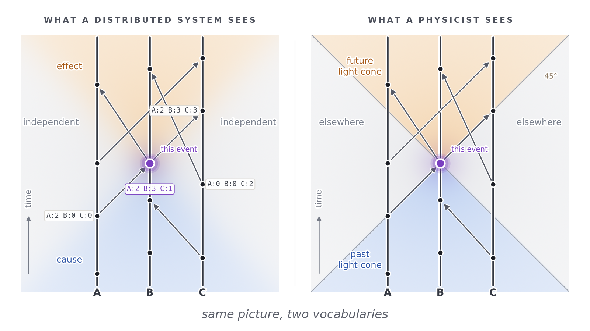

# What Time Is

*Quest for Entropy #12: time is not a thing that flows. It's a comparison — and the structure a comparison needs turns out to be the one my own industry invented for itself.*

## The question

*Time is money* — that is what smart people say. I'd argue time is worth more than money. Money comes and goes. Time only goes.

But value aside — what *is* it? Let me find out the slow way, starting with something easier.

Take a table. It has corners. Pick two of them, measure between them: one meter. The table exists. The wood exists. But where is the meter? You can't point at it. It isn't a part of the table. It appeared only when I compared the table against something else.

That's the whole trick of measurement. You never measure a thing. You compare it against another thing and write down the ratio.

And the thing we compare against is arbitrary. The meter started in 1793 as one ten-millionth of the distance from the north pole to the equator. In 1889 it became an object: a bar of platinum and iridium in a vault near Paris, held at a controlled temperature so it couldn't grow or shrink. That bar *was* the meter. Every ruler on Earth was a copy of a copy of that stick.

Today it's defined from light: a meter is the distance light travels in a vacuum in 1/299,792,458 of a second.

So length doesn't exist. Length is what comes out of a comparison.

Now do the same to time.

## The unit is a count on a ruler

We measure time in hours, and in smaller pieces called minutes. The word is Latin, not Greek: *pars minuta prima*, "the first small part" — the first cut of the hour into sixty. Then came *pars minuta secunda*, "the second small part", the next cut into sixty again.

That's where the name comes from. A second is literally *the second division*. Medieval astronomers kept going, with thirds and fourths. The sixty itself we inherited from the Babylonians.

Those are just names. The interesting part is how we actually measure.

For length you take a stick. For time you take a *process* — something that repeats — and you compare other processes against it. Sand falling. A pendulum swinging. An atom ringing.

And here's the part I find beautiful. The modern second is not a duration at all. **It's a count.** One second is defined as 9,192,631,770 oscillations of a caesium-133 atom. You don't measure a second. You count to it.

The order matters too. The second comes first. Then the speed of light is fixed by decree at exactly 299,792,458 meters per second. Only then does the meter fall out of it.

So the whole system stands on counting events inside an atom. Everything else is bookkeeping on top.

Which is where the ruler sneaks in. A count is never just a count. You count *something* — ticks of a pendulum, oscillations of an atom. The thing you count against is the ruler. The unit is a count on a ruler.

I grew up with film cameras. When the first digital ones arrived, the complaint was that they weren't as sharp as film — the pixels were an approximation of the real, continuous world. I quietly believed the world was like film: smooth, the real thing, and digital was the crude copy.

I don't think that belief is safe. Nobody has proven the world is continuous. It could be the other way around: digital at the bottom, pixels so small we can't see them, and the smooth world I live in is the approximation. The film, not the sensor.

Film was never continuous either. Zoom in far enough and it has grain — silver crystals, a chemical pixel. The poster-child of continuity was granular all along. So the question was never "continuous or digital." It was always *how fine is the grain, and does it have a bottom.*

A continuous world makes you invent the ruler — the meter bar, the caesium count, a unit I chose because I had to choose something. A discrete world hands you the ruler for free: count the grains.

And entropy, which I keep coming back to again and again in this series, requires the same ruler to be defined. It is the log of a number of states — and that number needs a unit.

## The sentence I'll keep repeating

Here it is, and the rest of this piece is just consequences of it:

> **Time is the distance between two events, and the only way you ever get that distance is by comparing them against a clock you happen to have locally.**

Read that again with the meter in mind. Same shape. Same trick.

Now the consequence that does the real work. If your whole local patch sped up — or slowed down — against everybody else's, **nothing inside it could tell.** Every ruler you'd check against changed by exactly the same amount. Your heart, your atoms, your caesium, your thoughts about your caesium.

You can't catch your own rate from the inside. You can only ever catch a *difference*, and only by comparing with someone who was somewhere else.

## The simulation that can't feel its own clock

Imagine people living inside a computer simulation. Their world, their clocks, their brains — all of it advances on the machine's ticks.

Now slow the machine down. Nothing happens. Nobody notices. Every process slowed together, so every comparison came out the same.

Take it further. Pause the simulation. Save it to disk. Leave it there for a hundred years. Load it and continue. From inside: nothing. No gap, no jolt, no missing Tuesday. The flow of time in there is perfectly smooth, because "smooth" only ever meant "my processes agree with each other".

Squash the simulated space. Stretch it. Same answer. The people inside have no ruler that didn't stretch with them.

I like this thought experiment because it isn't only a thought experiment for me. The toy universe this whole series is built on used to run on a master tick — a global clock, everything advancing together. Last week we tore the clock out completely. No ticks at all. The only thing left was "here is the next event that happens".

Every measurable quantity in that world stayed exactly where it was.

The inhabitants couldn't see the tick. There was no tick to see. (That's a later episode, with the numbers.)

## What bends, and what refuses to

Now the real world, which is stranger than my toy.

Time can run slower. Space can stretch. Two events that one observer calls simultaneous, another calls one-after-the-other, and neither of them is making a mistake. This isn't philosophy — it's engineering. GPS satellites correct for it every day or your car ends up in the wrong street.

So durations are negotiable. Simultaneity is negotiable.

One thing is not. **Cause and effect survive.** No observer, anywhere, moving any way, ever sees the effect before the cause. Everything else about the picture can be argued with. That, never.

Hold that combination in your head: *the amounts are flexible, the order is not.*

Because I've seen that exact combination before. Not in physics. At work.

## The toy: vector clocks

I'm a software architect. I spend my working life on distributed systems — many machines, no shared clock, all trying to agree on what happened.

That last part is harder than it sounds. There is no global "now" in a computer network. Each machine has its own clock and they all drift. If you stamp events with wall-clock time and sort them, you get nonsense: replies before questions, deletes before creates.

So we gave up on time and kept the only thing that matters: **order**.

Here's the machine, in plain words. Every participant keeps a little tally — one number per participant. Mine counts my own events. The rest are "the highest count I've heard about from you". Every time I do something, I bump my own number. Every message I send carries my whole tally along with it. When you receive it, you take the highest of each number, mine and yours.

That tally is a **vector clock**. It was invented by Colin Fidge and Friedemann Mattern, independently, both in 1988, on top of Leslie Lamport's 1978 paper about ordering events without a clock.

Now compare two tallies:

- If one is bigger or equal in *every* slot — that event could have caused the other. They're **ordered**.
- If each one is bigger in *some* slot — then neither could have reached the other. They're **concurrent**.

And concurrent doesn't mean "at the same time". It means something much stronger.

**There is no fact about which came first.**

Not "we don't know yet". Not "we'd need a better clock". There is nothing to know. The question has no answer, and the system works perfectly well without one.

The first time I properly understood that, I thought: I've read this somewhere else.

I had. And so, it turns out, had Lamport. His 1978 paper says outright that he took the idea from special relativity, and he drew his diagrams the way physicists draw spacetime. The two fields didn't converge by accident. One of them borrowed — and then almost everybody forgot, except the people who read the first page.

## The run: two observers, one history

I built a toy so you can see it rather than take my word for it. Three processes doing things and sending each other messages. Click any event and the picture splits into three regions: what could have caused it, what it could affect, and everything else.

Look at the two panels in the image at the top. Same events, same messages, same everything, drawn exactly the same way on both sides. Only the labels change. On the left, the words my industry uses: cause, effect, independent — read off the little tallies each process carries. On the right, the words a physicist uses: past light cone, future light cone, elsewhere. Nothing moved between the panels. The physicist adds one thing, and one thing only: a speed limit. That is why his boundary is a hard line at 45 degrees, while mine is soft — mine is only as sharp as the messages that happen to exist.

Left is a distributed-system diagram. Right is a Minkowski spacetime diagram. **Same picture, two vocabularies.**

Three things line up exactly:

**1. The order is absolute.** If one event could have caused another, everybody agrees about which came first. Always. In both worlds.

**2. Concurrency is real.** Incomparable tallies on the left; spacelike separation on the right. Different observers put those events in different orders, and nobody is wrong.

**3. Your clock is your own count.** Your position in your own tally is your personal time. Nothing else.

The demo has a button I like a lot: *ask another observer*. It takes the same history and produces a different valid ordering of it, then shows both logs side by side and counts the disagreements. Concurrent pairs flip freely. Causal pairs never flip.

I checked that the boring way rather than trusting it: four thousand generated worlds, eight settings of the slider, close to two million pairs compared. **Zero causally related pairs ever swapped.** They can't — the ordering is built from the causal structure, so the check is really asking whether the code does what the mathematics says, and it does.

And there's a slider for how much the processes talk to each other. Turn it down and two thirds of all event pairs are concurrent — a world where hardly anything has an order. Turn it up and that falls to about one in six, and the history starts to look like a single line. That slider is doing the job the speed of light does: it decides how much of the world can possibly know about the rest of it.

## "Now" is a consistent cut

This is the part I most want you to take away.

In distributed systems there's a thing called a **consistent cut** — a snapshot of the whole system where, if an event is in the snapshot, everything that caused it is in there too. There's a classic algorithm for taking one (Chandy and Lamport, 1985).

Two facts about consistent cuts. There are *many* valid ones. And no algorithm can give you the instantaneous global state, because in a system with no shared clock that thing isn't even definable.

In relativity, a "now" is a slice through spacetime where everything you call past really is in the past. There are many valid slices, one per observer, and none of them is the true one.

Those are the same definition.

**A "now" is a consistent cut.** Not a fact about the world. A choice of snapshot — of which many are legal, and all of them agree about causality.

If you've ever stared at a distributed trace trying to work out what really happened first, you already have the intuition for relativity of simultaneity. Nobody told you that's what you were doing.

## A universe full of cameras

Here's how I picture it now.

Fill space with observers. One at every point, like tiny cameras that only watch. Things move past them, and everything radiates information about itself. Each camera has its own clock and learns about an event only when the light from it arrives.

Physicists have a name for this: a *congruence of worldlines*. A reference frame in general relativity is exactly this — a whole family of observers, each with their own clock. In cosmology they're the "comoving observers", the ones the cosmic microwave background looks the same to in every direction.

In the vector-clock picture, every camera is a process and **light is the message**. Your entry for a distant observer is "the latest event of theirs whose light has reached me". So what you can know about them is your past light cone overlapped with theirs. That isn't an approximation of a distributed system's knowledge. It's the same object.

And one detail matters here, which is why I like this picture better than the quantum ones I usually write about: for big things, **watching doesn't disturb anything.** The cameras are passive. The causal structure is out there whether anyone looks or not. No measurement problem, no back-action, no arguments. Just bookkeeping.

## The twins, and what acceleration is really doing

Two ships leave the same place. One flies out and comes back. They meet again and their clocks disagree.

The usual confusion is: while they're apart, *each* one sees the other's clock running slow. That's true and it isn't a paradox. They're using different cuts. Neither is wrong, and neither can catch their own rate — remember the sentence.

The symmetry breaks for exactly one reason: one of them **turned around**. Changing your motion means changing which consistent cut you're using. During the turn, the other's clock appears to race ahead.

When they meet, the counts differ. And the count was the only real thing the whole time. Each of them aged by the number of events on their own chain.

If you want to watch the two counts come apart, the toy has a twins panel at the bottom: **[Two observers, one history](https://quest-for-entropy.web.app/two-observers)**. Move the turnaround and count the ticks yourself.

Here's the line I'd like you to keep:

> In ordinary geometry, the straight line is the **shortest** path between two points. In spacetime, the straight line is the **longest** path in time. Acceleration is what makes your chain shorter — so the twin who turned around simply had fewer ticks to count.

That's why acceleration matters in the twin story, and it's a much more satisfying answer than "because relativity says so". It isn't about the turn hurting. It's about which path through the events you took, and how many of them you were personally part of.

## The arrow: what writes the log

Two pillars so far. Order — which event could have caused which. The ruler — the count that turns order into duration. For most of this piece I thought that was all time needed. Here is what both of them miss.

A pendulum with no friction swings forever. The energy sloshes between two forms — motion at the bottom of the arc, height at the ends — and nothing is lost. Film it and play the film backwards: nobody can tell which version is the real one. Every frame of the reversed film obeys the same laws as the forward one. This little system has order, and it has a count — one swing, two, three — and still no direction. The count climbs in both films.

The happens-before diagrams from earlier have the same blind spot, which surprised me when I checked. Flip every arrow in one and you get another perfectly legal diagram. The order glues cause to effect — it doesn't say which end is which. The bookkeeping reads the same in both directions.

Now a real pendulum. Friction. Each swing a little lower than the last, until it hangs still. The energy didn't vanish — it scattered into heat: the trembling of billions of molecules, split into so many small pieces that nobody could ever gather them back. Play *this* film backwards and you laugh out loud. Warmth collects itself out of the room and kicks a pendulum into motion. That never happens. Entropy — energy spreading into forms you can't call back — is the first thing in this whole story that knows which way the film runs.

My industry has an object for this too, and it may be the most load-bearing thing we own: the **append-only log**. Databases keep one. Banks keep one. Every serious system keeps one. The rule is short: you can append, you can never un-append. When a record makes it into the log, we say it's *committed* — and committed means *happened*. Everything else — the tables, the balances, the current state — can crash and be rebuilt from the log. The log is the truth.

The universe keeps its log the same way, and the cameras from earlier show where it's kept. Every event broadcasts itself — light leaves the scene at the fastest speed there is and gets recorded at every camera it reaches. To un-happen an event you'd have to chase down every copy and wipe them all, and the copies are running away from you at the speed of light. That is what the friction was doing to the pendulum all along: not destroying the motion but *writing it down*, into a trillion molecular jiggles — a record so scattered that erasing it isn't forbidden, just hopeless.

So the third pillar, next to order and the ruler:

> **Entropy is the pen.** Order says which events are glued together as cause and effect. The count says how many ticks lie between them. Entropy is what writes them into the log — and a written event is not just "happened". It's *had irreversibly happened*.

(Honesty first: in my toy the log only grows because I built it that way — an append-only array, a choice, same as the 45 degrees. The universe has a better reason: statistics. A scattered record has astronomically many ways to stay scattered and essentially none to gather itself back. This series is named after entropy, and this is where entropy enters the story of time — holding the pen.)

## The Confession

First, a correction to my own draft. I wanted to write that in a computer network a message can be as fast or as slow as it likes, while spacetime has one fixed top speed. That is wrong. A network message is bound by cable length and by the speed of light in glass, like everything else. Put the nodes in a properly synchronized mesh and the same relativistic picture holds for them too. The speed limit is not what separates the two panels. My *toy* is what has no speed limit — I drew those 45 degrees in by hand, and that is a choice, not a result.

So here is where I have landed. This is not a claim. It is the working postulate for the rest of this series.

Time has three parts:

1. **The arrow.** Entropy holds the pen. It is what makes effect follow cause, and never the other way round.
2. **The order.** Cause before effect, guaranteed. Every observer agrees on it.
3. **The ruler.** A count on a local process. Yours is yours — which is exactly why duration is relative.

And one thing that is *not* on the list: global time. There is no universal clock ticking somewhere for everybody. What exists is the whole sequence of events.

## What this does NOT claim

> I have not derived relativity from computer science. I've shown that the causal structure relativity protects, and the causal structure distributed systems invent for themselves, are the same mathematical object — which is not a discovery of mine, it's a lineage that goes back to Lamport's own footnotes and forward into causal set theory. The demo is a toy with no metric, no invariant light speed and no gravity. Nothing here is a claim about how nature is built. It's a claim about what "time" has to mean if measurement is always comparison.

## The neighbors

I'm not a physicist, and this is the part where you should go read people who are.

**Causal set theory** is the serious version of everything above: Bombelli, Lee, Meyer and Sorkin (1987) proposed that spacetime is fundamentally a discrete set of events with a causal order, and Sorkin's slogan for it is *"order plus number equals geometry"* — the order gives you the cones, the counting gives you the volume, and together they give the metric. If reading this piece gave you an idea, that field probably had it in 1987 and did it properly.

**David Malament (1977)** proved the precise statement I leaned on: causal structure determines the geometry up to scale.

**Leslie Lamport (1978)** for happens-before, and **Colin Fidge and Friedemann Mattern (1988)** for vector clocks themselves. **Chandy and Lamport (1985)** for consistent snapshots.

**Carlo Rovelli** has spent a career arguing that time is relational and not fundamental. **Page and Wootters** showed how time can emerge as correlation with a clock *inside* a universe that has no time at all. **Julian Barbour**'s *The End of Time* is the popular-level version of the same suspicion.

**Stephen Wolfram**'s causal graphs are close cousins of the picture above — and his "causal invariance", the idea that different update orders give the same causal graph, is precisely what the *ask another observer* button is testing.

If you want the honest one-line summary of my contribution: I came in through the service entrance.

## Run it yourself

The two-observers toy is here: **[Two observers, one history](https://quest-for-entropy.web.app/two-observers)**. Click an event and watch both diagrams split into past, future and elsewhere. Press *ask another observer*. Drag the *message rate* slider down until the world stops having an order. There's a twins panel at the bottom that counts ticks along two routes between the same two events.

The whole thing is one HTML file with the physics in plain sight — open the page source and the vector-clock comparison is about six lines.

The numbers I quoted are checkable: **[companion code](https://github.com/masteris777/quest-for-entropy-what-time-is)**. One command rebuilds the four thousand worlds and re-measures both of them. The model there is a line-for-line port of the page's own code, and rather than ask you to take that on trust, the repo runs both versions on the same seeds and checks that every count agrees.

## How this was made

I'm a software architect. The physics and the deep math are what I'm curious about, not my job, and I use AI to explore them. The honest split: the heavy lifting — the math, the physics checks, the code, the sums — is AI, with me setting the direction, asking the questions, and making the calls. To keep us honest, the work runs through a harness I built: every experiment follows rules fixed in advance, results get challenged by independent AI review, and every mistake we catch goes into a public honesty ledger.

This episode is mostly argument rather than experiment — the only thing measured here is the toy itself. The idea and the argument are mine; the fact-checking, the corrections and the demo came out of the harness. Where I got history or physics wrong in my own first draft — and I did, in five places — the corrected version is what you just read, and the corrections are named rather than quietly patched.

The one about the minute being a Greek word for "fraction" was mine. It's Latin, and it means "the first small part". I liked the true version better anyway — [RobWords tells this one properly](https://www.youtube.com/watch?v=TK-8gfqmFNo).

## Next time

One thing has been driving this whole series: finding a deterministic mechanism that produces quantum mechanics. I have tried many. Most of them failed. The first, built out of rotors, passed a few of my quantum exams and then broke on the ones that actually matter — entanglement, and Bell.

Thinking about time is what gave me the missing idea.

The model I have now passes every exam I have built for it: 139 checks, zero failures, across quantum mechanics, relativity, black holes and the expanding universe. That is not the same as being right — a test battery you wrote yourself is a battery you can accidentally write to pass — so it arrives with its debts named out loud. The Born rule is still half-imported. The entangled bookkeeping costs 2^k and always will. And the model overshoots Mercury's orbit by 17%: it carries β = ½ where general relativity has β = 1. That last one is a real, falsifiable deviation, and it is the sharpest thing anybody can hit me with.

Next time: **The Iceberg** — a blockchain-inspired model of the universe.

---

*Quest for Entropy is written by Marijus Masteika. Entropy was always the dark horse for me — connected to information, and maybe hiding answers to everything. That's the quest.*
